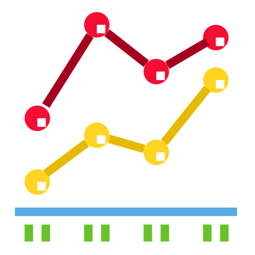

#### Привет &#x1F44B;

Я специалист по анализу данных и машинному обучению.  
* &#x1F393; Более 3 лет работаю аналитиком в Высшей школе экономики (НИУ ВШЭ).  
&ensp;&ensp;&ensp;Сфера деятельности: анализ социально-экономических показателей, сравнительный анализ региональных данных,  
&ensp;&ensp;&ensp;статистическая оценка данных опросов (региональные, областные администрации).
   
* 👷‍♂️ Hard skills:  
    &ensp;&ensp;&ensp;\- описательная и предиктивная аналитика, регрессионный анализ;  
    &ensp;&ensp;&ensp;\- методы машиного обучения (классификация, регрессия, кластеризация);  
    &ensp;&ensp;&ensp;\- дата-инженерные задачи, построение ETL-пайплайнов (SQL, Clickhouse, Airflow);  
    &ensp;&ensp;&ensp;\- программирование и статистические пакеты: Python, R, Stata, SPSS, Statistica;  
    &ensp;&ensp;&ensp;\- ML-алгоритмы и библиотеки: sklearn, scipy, statsmodels, xgboost, etc.;  
    &ensp;&ensp;&ensp;\- визуализация и BI (Superset, Redash, Tableau)

#### Список проектов

####  &ensp; [Сочетание регрессионного анализа и машинного обучения для увеличения точности и интерпретируемости модели](https://a-chasovsky.github.io/house-prices/)

 &ensp; &ensp; &ensp; *Регрессионный анализ, машинное обучение, описательная аналитика, предиктивная аналитика* 

####  &ensp; [Обнаружение мошеннических операций с кредитными картами](https://a-chasovsky.github.io/credit-card-fraud-detection/)

 &ensp; &ensp; &ensp; *Машинное обучение, классификация* 

В работе исследуется эффективность популярных алгоритмов машинного обучения, применяемых для выявления мошеннических операций с кредитными картами. 

Для повышения эффективности создаются новые переменные, учитывающие поведение клиентов (согласно RFM). При обучении и валидации моделей учитываются особенности работы с банковскими транзакциями и временными рядами. Для оценки ML-алгоритмов применяются метрики AUC ROC, Average Precision, Card Precision, строятся кривые ROC и PR, исследуется влияние величины порогового коэффициента. 

Дополнительно рассматриваются техники работы с несбалансированными датасетами: undersampling, комбинирование undersampling и oversampling, присваение весов классам. 

####  &ensp; [Данные Росстата о состоянии экономики РФ](https://a-chasovsky.github.io/economics-rus/)

 &ensp; &ensp; &ensp; *Преобразование и визуализация данных Росстата* 

####  &ensp; [MotoGP Analytics](https://a-chasovsky.github.io/motogp-analytics/)

 &ensp; &ensp; &ensp; *Аналитика данных* 

Одно из направлений data science - спортивная аналитика. Обычно исследуются данные наиболее популярных видов спорта: футбол, баскетбол, бейсбол, американский футбол. В свою очередь, я придумал методику, с помощью которой можно лучше понять такой вид спорта, как чемпионат мира по мотогонкам MotoGP. По запросу пользователя скрипт автоматически скачивает протокол гонки в формате pdf (используя навигацию сайта), извлекает из него данные, преобразовывает, считает метрики и строит итоговые графики.  

####  &ensp; [Anomaly Detection System](https://github.com/a-chasovsky/kc_anomaly_detection_system)

 &ensp; &ensp; &ensp; *Аналитика данных* 

Система осуществляет поиск аномалий в данных в режиме, близком к реальному времени (временной интервал - 15 минут). В качестве базового периода берутся средние значения аналогичного интервала за предыдущие 3 дня, считаются верхние и нижние пороги, и в случае обнаружения аномальных значений ответственному лицу отправляется сообщение в мессенджере Telegram.

####  &ensp; [ETL-Pipeline](https://github.com/a-chasovsky/kc_etl_pipeline)

 &ensp; &ensp; &ensp; *Дата-инжиниринг* 

Данные выгружаются из нескольких таблиц БД, рассчитываются агрегированные характеристики. Результаты записываются в датафрейм, который загружается обратно в базу. Процедура повторяется один раз в сутки.

####  &ensp; [A/B Test](https://github.com/a-chasovsky/kc_ab_testing)

 &ensp; &ensp; &ensp; *Статистические тесты* 

A/B тест с выводами и рекомендациями.