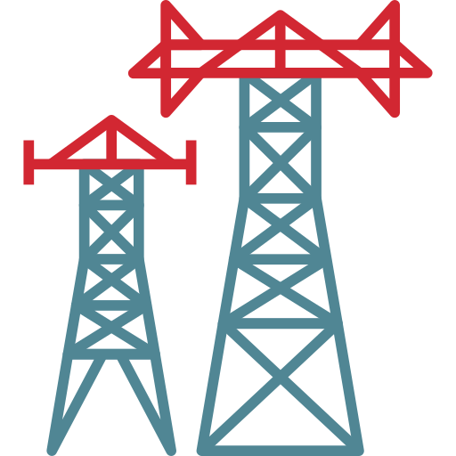

<b>Привет</b> &nbsp; &#x1F44B;

Я работаю специалистом по анализу данных и машинному обучению.

- 🏛️ &nbsp; Сфера деятельности:  
&ensp;&ensp;&ensp;&ensp;&nbsp; - анализ социально-экономических показателей;  
&ensp;&ensp;&ensp;&ensp;&nbsp; - сравнительный анализ региональных данных;  
&ensp;&ensp;&ensp;&ensp;&nbsp; - исследования в сотрудничестве с региональными и областными администрациями;  
&ensp;&ensp;&ensp;&ensp;&nbsp; - научно-исследовательские работы (экономика, гос. управление).
   
- ⚒️ &nbsp; Инструментарий:   
&ensp;&ensp;&ensp;&ensp;&nbsp; - статистический анализ данных;  
&ensp;&ensp;&ensp;&ensp;&nbsp; - описательная и предиктивная аналитика;  
&ensp;&ensp;&ensp;&ensp;&nbsp; - машинное обучение (классификация, регрессия, кластеризация);  
&ensp;&ensp;&ensp;&ensp;&nbsp; - дата-инженерные задачи, ETL-пайплайны (SQL, Clickhouse, Airflow);  
&ensp;&ensp;&ensp;&ensp;&nbsp; - визуализация и BI (Superset, Redash, Tableau);  
&ensp;&ensp;&ensp;&ensp;&nbsp; - программирование и статистические пакеты: Python, R, Stata;  
&ensp;&ensp;&ensp;&ensp;&nbsp; - ML-алгоритмы и библиотеки Python: Sklearn, Scipy, Statsmodels, etc. 

- 🎓 &nbsp; Изучаю сейчас:  
&ensp;&ensp;&ensp;&ensp;&nbsp; - Временные ряды: методы анализа и прогнозирования.

#

<b>Проекты</b>

-  &nbsp; Стратегии бустинга авторегрессионной модели - <a href='https://achasovsky.github.io/autoregression-boosting/'>Autoregression-Boosting</a> (в процессе)

-  &nbsp; Комбинирование регрессионного анализа и машинного обучения - <a href='https://achasovsky.github.io/advanced-regression/' target='_blank'>Advanced-Regression</a>

-  &nbsp; Обнаружение мошеннических операций с кредитными картами - <a href='https://achasovsky.github.io/credit-card-fraud-detection/'>Credit-Card-Fraud-Detection</a>

-  &nbsp; Дашборд 'Экономика России' - <a href='https://economy-rus-dash.onrender.com/inflation-and-prices'>Economy-Rus-Dashboard</a> (в процессе)

-  &nbsp; Преобразование и визуализация данных Росстата - <a href='https://achasovsky.github.io/economy-rus/'>Economy-Rus</a>

-  &nbsp; Методика анализа данных чемпионата MotoGP - <a href='https://achasovsky.github.io/motogp-analytics/'>MotoGP-Analytics</a>

#

Другие проекты по работе с данными:

&ensp;&ensp;   &ensp;&nbsp;
 &nbsp; [ETL-Pipeline](https://github.com/achasovsky/etl-pipeline)
&ensp;&ensp; | &ensp;&nbsp;
 &nbsp; [A/B-Test](https://github.com/achasovsky/ab-testing)
&ensp;&ensp; | &ensp;&ensp;
 &nbsp; [Anomaly-Detection](https://github.com/achasovsky/anomaly-detection-system)
&ensp;&ensp; | &ensp;&ensp;
 &nbsp; [Poisson-Bootstrap](https://github.com/achasovsky/poisson_bootstrap)  
